### SW Pipeline to identify the lane boundaries ina  video from a front-facing camera on a car
#### Dynamic Results of lanes line detection on the road on the trial track [here](https://github.com/Jeanyvesbourdoncle/Advanced-lane-lines-finding-on-the-road/blob/master/output_video/project_video.mp4).

----------------------

The differents steps of the SW Pipeline are the following :
#### Step 0 : Compute the camera calibration matrix and distortion coefficients given a set of chessboard images.

#### Step 1 : Apply a distortion correction to raw images.

#### Step 2 : Use color transforms, gradients, etc., to create a thresholded binary image.

#### Step 3 : Apply a perspective transform to rectify binary image ("birds-eye view").

#### Step 4 : Detect lane pixels and fit to find the lane boundary.

#### Step 5 : Determine the curvature of the lane and vehicle position with respect to center. Warp the detected lane boundaries back onto the original image.

#### Step 6 : Output visual display of the lane boundaries and numerical estimation of lane curvature and vehicle position.

---------------------------------------------------------------------------
#### Program modularity

##### The generic fonctions are present in the module CV_function.py
This part is a generic part (must be not change). 

Only a specific part is here present in this generic part:

- modification of the differents threshold gradient (-x, -x, -mag, -dir) and threshold colors 

- modification of the 3 hyperparameters "window" (pixel analyze)

##### The main program is named SW_Pipeline_Advanced_Lane_Finding.ipynb
You can find in the other part named is named SW_Pipeline_Advanced_Lane_Finding.ipynb. 

He calls for every stages of the SW pipeline the generic fonctionc impemented in the module CV_funtion.py

----------------------------------------------------------------------------
##### Step 0 : Camera Calibration

The functionnalities "camera calibration" and "distorsion correction" with the chessboards are directly
implemented in the CV_function.py for the generic part. 

For the specific part, the code is implemented in SW_Pipeline_Advanced_Lane_Finding.ipynb.

The SW design method is very good explains in the code comments. 

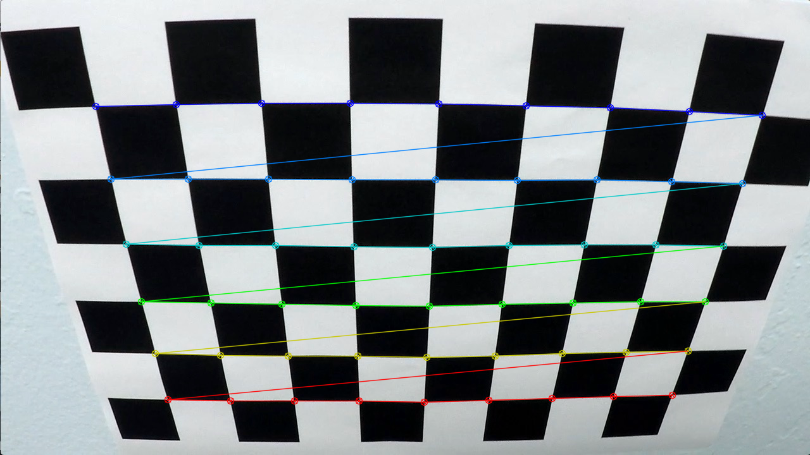 
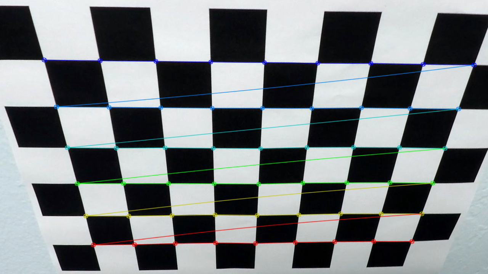

--------------------------------------------------------------------------
##### Step 1 : Distorsion Correction

The functionnality "distorsion correction" is generic and  directly implemented in the CV_function.py.

This module is call in SW_Pipeline_Advanced_Lane_Finding.ipynb. 

The input are the raw image. The output is the undistorded image.

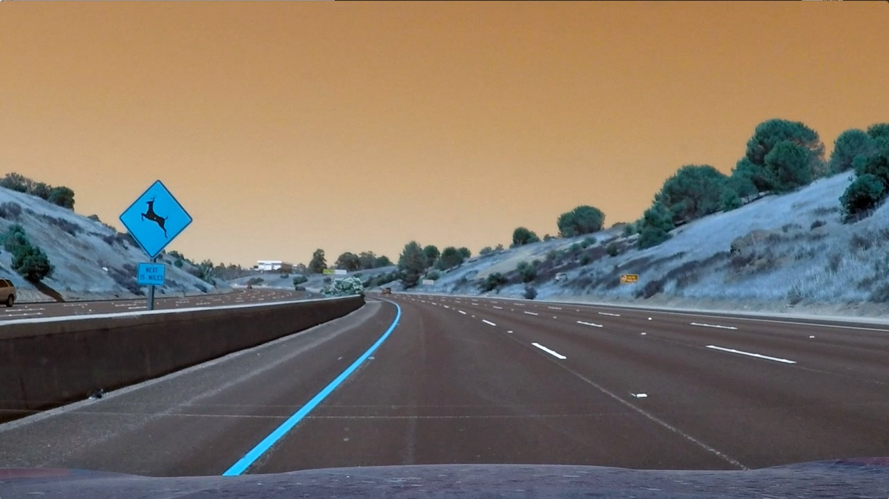 
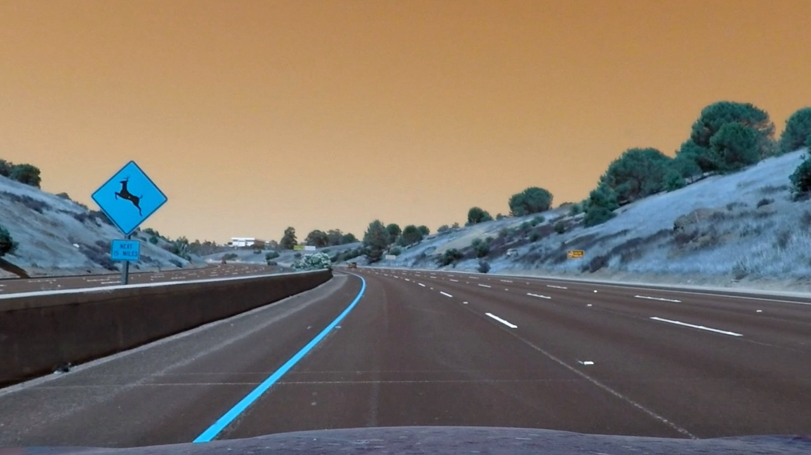

---------------------------------------------------------------------------
##### Step 2 : Color Transforms and Gradients

The functionnality "color transform and gradient thresholding" is generic and  directly implemented in the CV_function.py.

The input images are the images after distorsion correction. The output images are the images witht the configured threshold.

A lot of combinaison are possible (colors threshold/gradient-x/gradient-y/gradient direction/gradient magnitude). For this exercice, we used only the x-gradient and the colors transform (L+S Channel,L for the problem of shadow). The others parameters (mag/dir) have not been used.

This step (threshold configuration) costs a long time, because the thresholds are configured manually.

PLease find the 4 images bellow (with x-gradient thresholding alone, with thresholding color (S-Channel) alone, with thresholding color (L-Channel) alone and the combined solution)

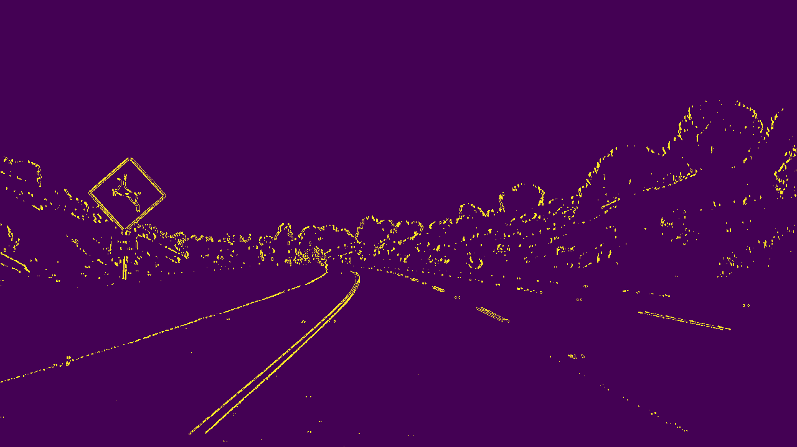 
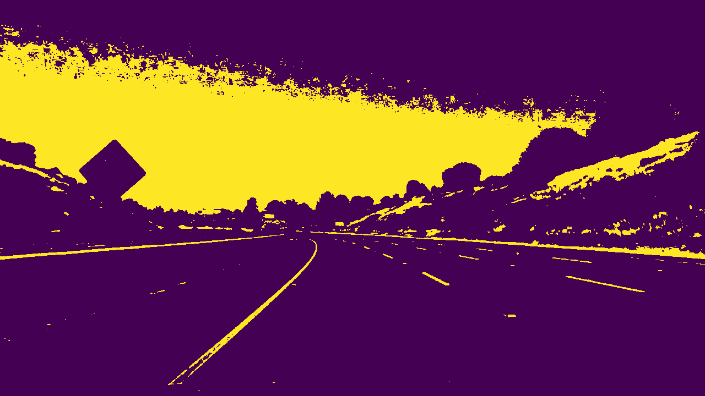
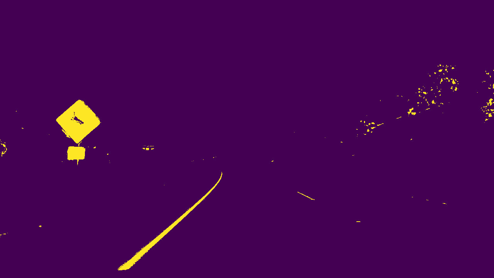
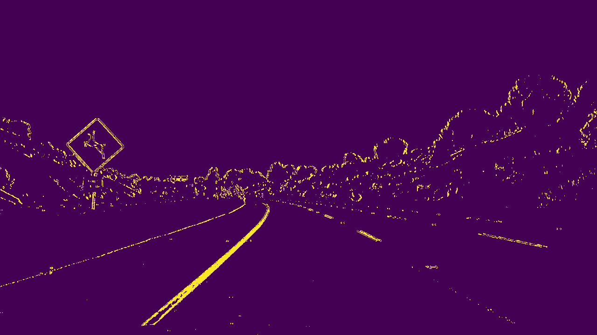

----------------------------------------------------------------------------------
##### Step 3 : Perspective Transform ("birds-eye view")

The functionnality "perspective transform" is generic and  directly implemented in the CV_function.py.

The target is to take 4 points (x,y) very far in the image to make a better analyze and to make a perspective transform.

 
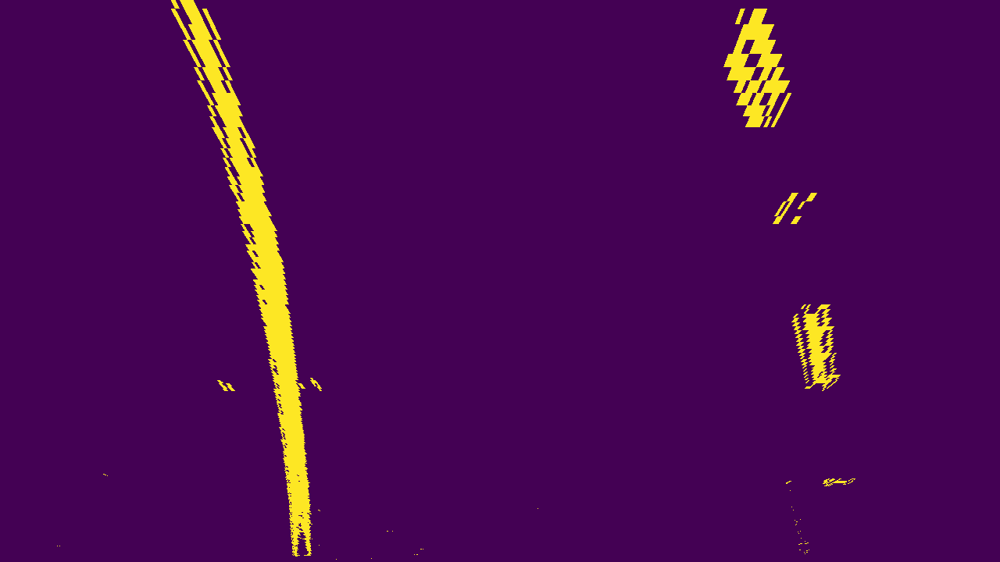

---------------------------------------------------------------------------------

##### Step 4 : Lane line pixels and fit their positions with a polynomial

2 Steps are here useful : 
- the lane-line pixels identification 
and 
- the polynomial curve for every lane (right and left)

Two generics functionalities implemented in CV_function.py are here useful : 
- the lane-line pixel indentification 
and 
- the polynomial curve for every line. 

For information : Blue and Red are the colors for the lane left and the lane right. 

To add the two polynomial, these 2 lines are superposed on the plot with the 2 lanes pixels:

- plt.plot(left_fitx, ploty, color='yellow')
- plt.plot(right_fitx, ploty, color='yellow')

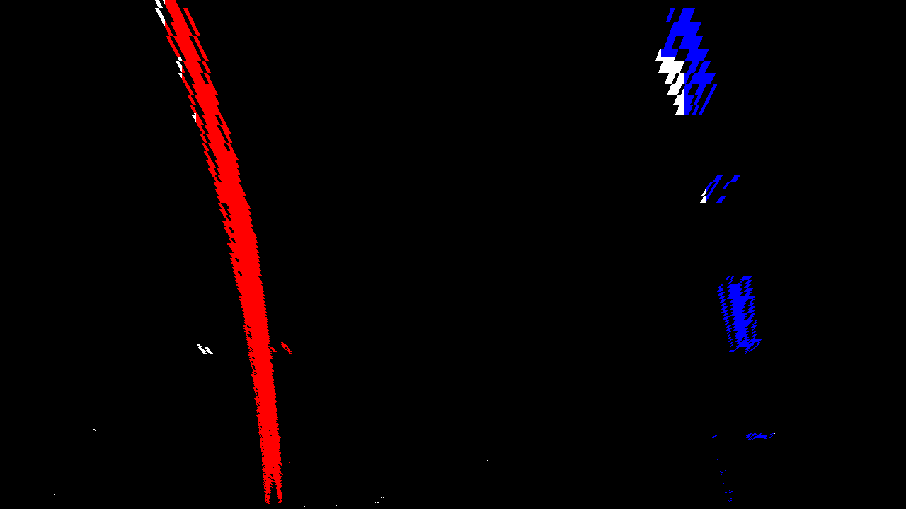 

------------------------------------------------------------------------------------

##### Step 5 : Calculation of the radius of curvature of the lane and the position of the vehicle with respect to center

We need 2 generics functionalities implemented in CV_function.py: 

Step 1 : radius of curvature : The most important point is the transfert from the "pixel world" to the "real world" (in meters)

Step 2 : position of the vehicule

------------------------------------------------------------------------------------------
##### Step 6 : Main Program 

Here you can find the pipeline with the comment (main programm) and the results for every frame :

####"PIPELINE"####
def process_image(image):
    
    #Step 1 = camera calibration + image undistorted 
    undist =calculation_undistort(image,objpoints,imgpoints)
    
    #Step 2 = Threshold (gradient (-x/-y/-mag/-dir) and color) configuration and threshold combinaison
    _, _, _, _, _, combined_binary,_ = image_computing(undist)
    
    #Step 3 = Perspective Transform, the target is to select 4 points very far in the image foe a better analyze
    # This function returns Minv, because he will be use in the Step, in the reconstitution step
    warped,Minv = warper(combined_binary, src, dst)
    
    #Step 4 : the target is to know the dedicated pixels for the lane right and the lane left 
    # the standard method named "peak/histogram" is used (convolution mathod not used) with windows configured with hyperparameters
    leftx, lefty, rightx, righty,left_lane_inds, right_lane_inds = find_lanes_pixels(warped)
    
    #Step 5a = polynomial fonction for the right and the left curve
    left_fit, right_fit, ploty, left_fitx, right_fitx, out_img= fit_polynomial (warped, leftx, lefty, rightx, righty, left_lane_inds, right_lane_inds)
   
    #Step 5b = Diagnostic information 1 : curvature calculation (space conversion : from "pixel" world to "meters" world)
    left_radius_curve,right_radius_curve = calculation_curvature (leftx, lefty, rightx, righty)
    
    #Step 5c = Diagnostic information 2 : deviation of the vehicle with the "central line" reference
    vehicle_position = calculation_vehicle_position (undist, left_fit, right_fit)
    
    #Step 6 = Vizualization of the image (before processing) with all the informations (diagnostics + lane detection tracking)
    result = vizualization(undist, left_fit, right_fit, Minv, left_radius_curve, left_radius_curve, vehicle_position)
     
    return result  

-----------------------------------------------------------------------------------
#### Static results 

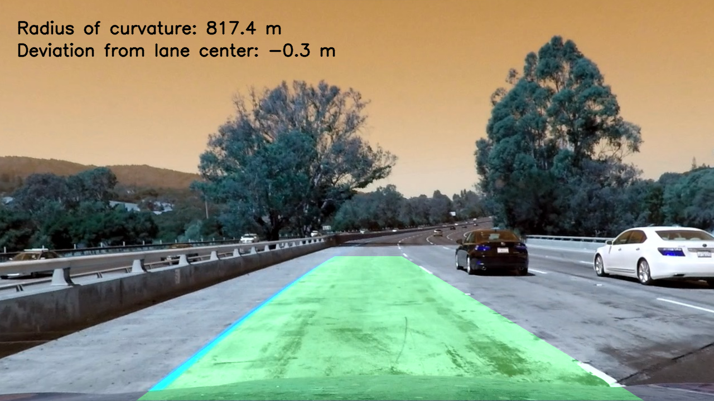 
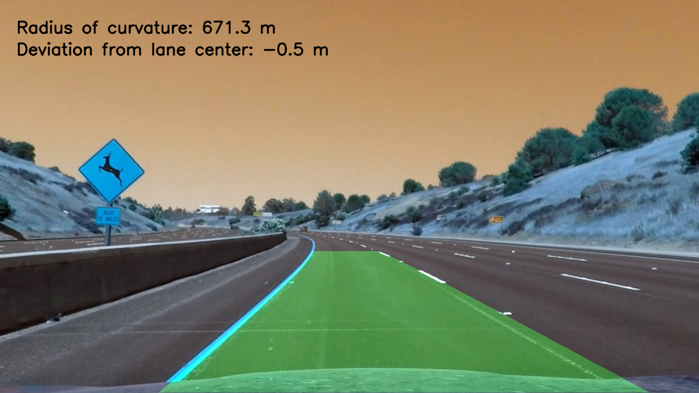
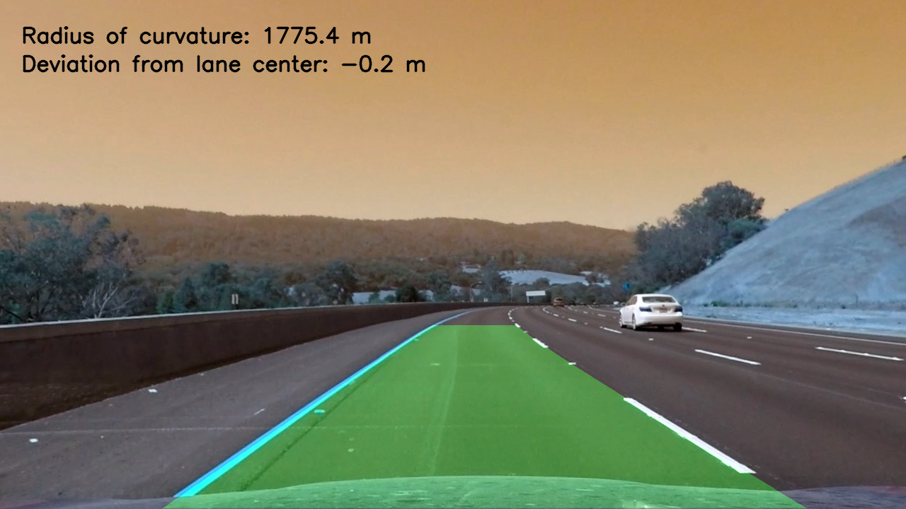
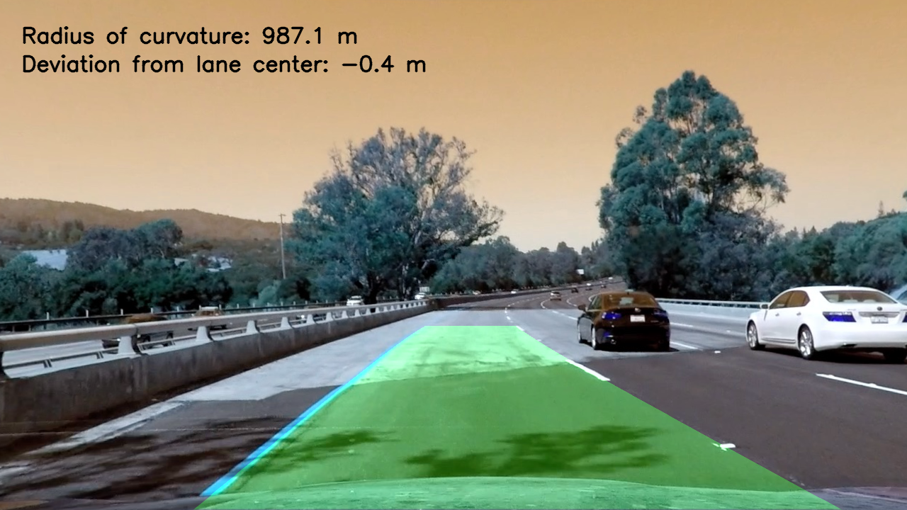

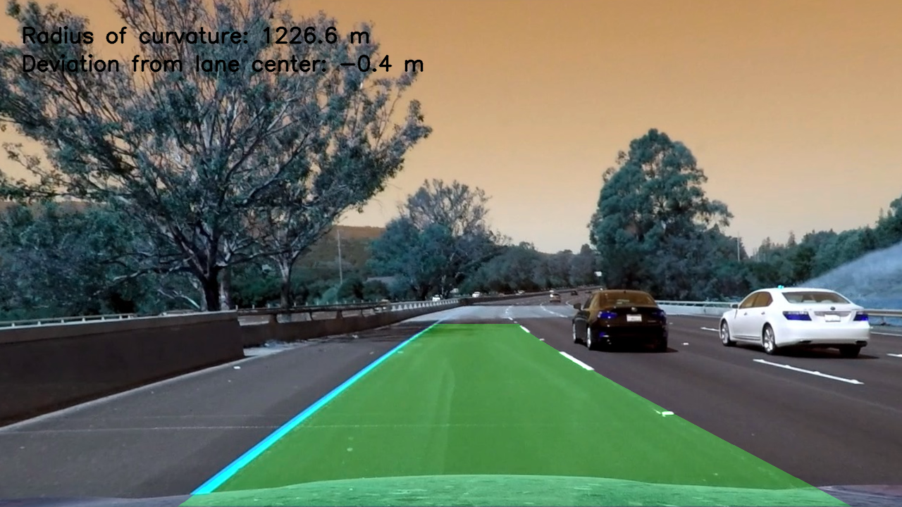
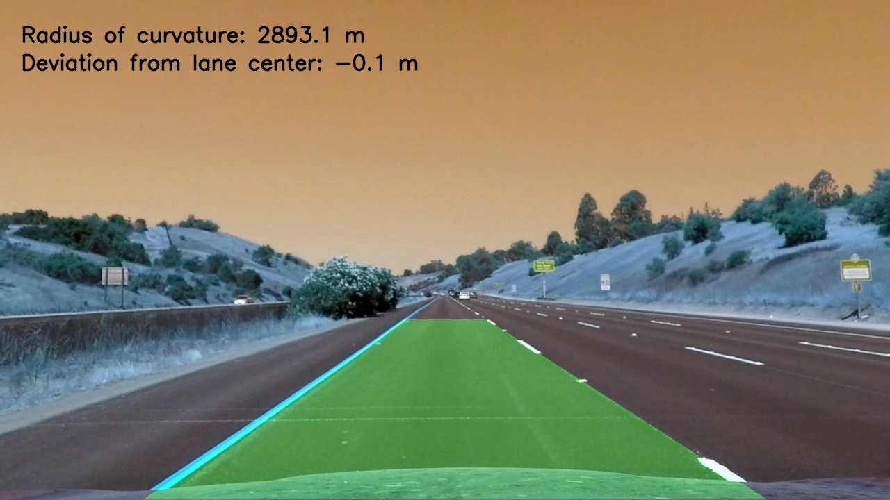
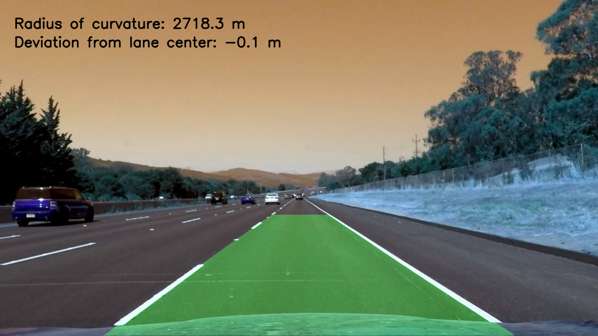

